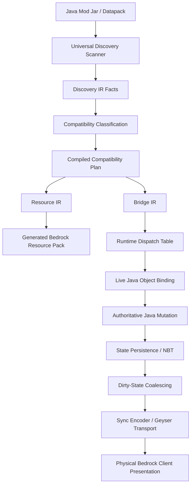
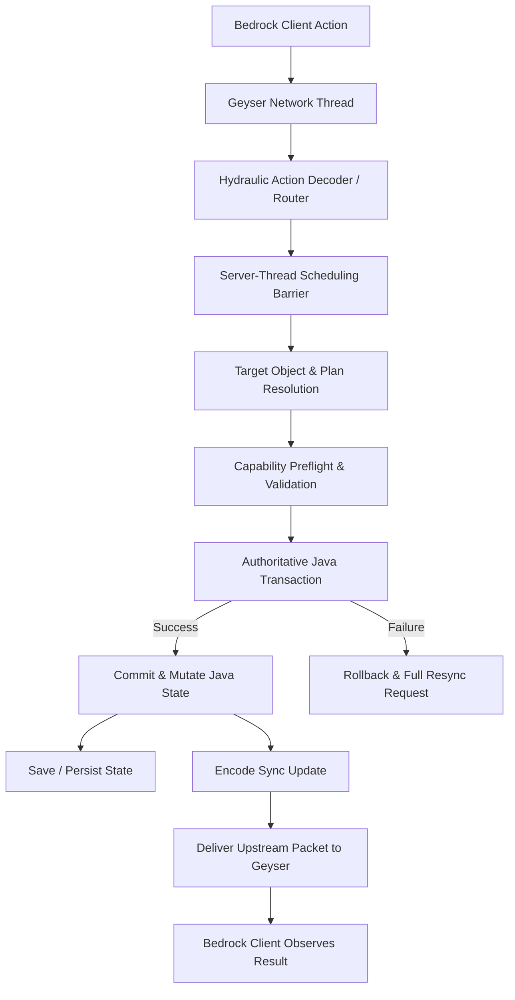

# Full Implementation Plan — Master Execution Ledger

## Authority and Core Mandate

This ledger is the post-audit execution baseline for Hydraulic (Phlodgate). It forbids claiming that a capability is complete merely because an interface, data class, unit test, or resource pack conversion exists. A capability is complete only after authoritative Java mutation, transactional persistence, Geyser synchronization, and verified physical Bedrock client observation are recorded.

### Capability State Vocabulary

Every capability, subsystem, and compatibility slice is evaluated using strict, unambiguous status classifications:

- `OPEN`: Specification or interface exists; end-to-end execution path is missing or unverified.
- `IN_PROGRESS`: Partial execution, unit test, or localized bridge exists; one or more pipeline stages are incomplete.
- `SERVER_VERIFIED`: Authoritative Java server mutation, transaction, and state persistence are verified on the Java server thread.
- `TRANSPORT_VERIFIED`: Encoded state change or packet has been handed off to Geyser's active network session without transport error.
- `CLIENT_VERIFIED`: A physical Bedrock client has received, rendered, interacted with, or verified the state change in a real session.
- `BLOCKED`: Progression is halted by an external dependency, hardware/environment limitation, or upstream protocol barrier.

### Non-Negotiable Maturity Distinction

To prevent false-completion claims, all reports, documentation, and code must enforce this distinction:

$$\text{IMPLEMENTED} \neq \text{VERIFIED} \neq \text{SUPPORTED}$$

$$\text{Bridge Exists} \xrightarrow{\neq} \text{Works on Fixture} \xrightarrow{\neq} \text{Works on Arbitrary Mod} \xrightarrow{\neq} \text{Bedrock Can Invoke} \xrightarrow{\neq} \text{Bedrock Observes} \xrightarrow{\neq} \text{Persists Across Restart}$$

---

## Bidirectional Round-Trip Pipelines

Every supported capability must travel both directions through the architecture without loss, duplication, or thread desynchronization.

### Pipeline A: Java Mod to Bedrock Presentation and State

### Pipeline B: Bedrock-Originated Action to Java Mutation

---

## Active Capability Round-Trip Matrix

Status values: `PASS` (stage proven with evidence), `PARTIAL` (incomplete implementation or fixture-only), `OPEN` (not implemented), `BLOCKED` (environmental barrier).

| Capability Domain | Discovery | Classification | Runtime Plan | Live Binding | Java Execution | State Persistence | Java to Bedrock Sync | Bedrock to Java Action | Physical Bedrock Validation |
| :--- | :---: | :---: | :---: | :---: | :---: | :---: | :---: | :---: | :---: |
| **Item Inventory / Transfer** | PASS | PASS | PASS | PASS | PASS | PARTIAL | PARTIAL | PARTIAL | BLOCKED |
| **Fluid Transfer / Tanks** | PASS | PASS | PASS | PASS | PASS | OPEN | TRANSPORT | PARTIAL | BLOCKED |
| **Energy Transfer / Storage** | PASS | PASS | PASS | PASS | PASS | OPEN | OPEN | OPEN | BLOCKED |
| **Machine Processing** | PASS | PASS | PASS | PARTIAL | PASS | PARTIAL | PARTIAL | PARTIAL | BLOCKED |
| **Menu / Container UI** | PASS | PASS | PASS | PARTIAL | PARTIAL | PARTIAL | PARTIAL | PARTIAL | BLOCKED |
| **Entity Interaction / AI** | PARTIAL | PARTIAL | PASS | PARTIAL | PARTIAL | OPEN | OPEN | PARTIAL | BLOCKED |
| **Automation / Logistics** | PASS | PASS | PASS | PARTIAL | PARTIAL | OPEN | PARTIAL | OPEN | BLOCKED |

---

## 35-Phase Atomic Master Execution Breakdown

### Phase 0: Establish the Completion Contract and Evidence Standards
- **Task 0.1: Formalize Status Contracts:** Ensure all codebase enums (`SyncDeliveryStatus`, `ImplementationMaturity`, `SupportLevel`) align with the 6-state vocabulary (`OPEN`, `IN_PROGRESS`, `SERVER_VERIFIED`, `TRANSPORT_VERIFIED`, `CLIENT_VERIFIED`, `BLOCKED`).
- **Task 0.2: Bidirectional Trace Enforcement:** Ensure `RuntimeTraceId` is attached at action ingestion and carried through simulation, mutation, persistence, sync encoding, and Geyser transport handoff.
- **Inspect Files:** `shared/.../compat/runtime/SyncDeliveryStatus.java`, `shared/.../compat/runtime/RuntimeTraceId.java`.
- **Required Tests:** `RuntimeTraceIdTest`, `SyncPlannerTest`.
- **Exit Gate:** No subsystem emits a single boolean "success" without an accompanying traceable transaction record.

### Phase 1: Universal Resource Index (Consolidation of Discovery)
- **Task 1.1: Scanner Audit and Replacement:** Audit and deprecate fragmented `Files.walk` and redundant zip inspections in `CompatibilityManager`, `PackUtil`, and individual pack modules.
- **Task 1.2: Implement `UniversalResourceIndex`:** Unify resource tracking across 18 resource kinds (`MOD`, `RESOURCE`, `ASSET`, `MODEL`, `TEXTURE`, `BLOCKSTATE`, `ITEM_MODEL`, `RECIPE`, `TAG`, `LANGUAGE`, `SOUND`, `ANIMATION`, `ENTITY`, `BLOCK_ENTITY`, `MENU`, `DATA`, `CONFIG`, `PACK`).
- **Task 1.3: Explicit Dependency Graph:** Build indexed dependency edges (`BlockState -> Model -> Texture`, `Machine -> Block -> BlockEntity -> Menu -> Recipe -> Texture`).
- **Inspect Files:** `shared/.../pack/ModResourceIndex.java`, `shared/.../compat/CompatibilityManager.java`, `shared/.../pack/PackUtil.java`.
- **Required Tests:** `ModResourceIndexTest`, `TextureDependencyGraphTest`, `UniversalResourceIndexGraphTest`.
- **Exit Gate:** Exactly one filesystem/jar discovery pass occurs per mod root during startup.

### Phase 2: Persistent Incremental Caching and Content Addressing
- **Task 2.1: Source Fingerprint Hierarchy:** Implement `SourceFingerprint` (directory size/mtime/hashes; jar SHA-256 and size; metadata hash; toolchain hash).
- **Task 2.2: Comprehensive Conversion Key:** Construct `ConversionKey` containing mod fingerprint, Hydraulic version, compatibility engine version, Bedrock target schema version, and Geyser version.
- **Task 2.3: Content-Addressed Intermediate Storage:** Cache intermediate artifacts (Discovery IR, Compatibility IR, Compiled Plans, stitched models, converted textures) under `config/hydraulic/cache/`.
- **Inspect Files:** `shared/.../pack/ConversionKey.java`, `shared/.../cache/*`.
- **Required Tests:** `ConversionKeyTest`, `ArtifactCacheTest`.
- **Exit Gate:** Repeated server startup with unchanged mods and configs incurs zero model/texture reconversion cost.

### Phase 3: Typed Intermediate Representation (IR) Pipeline
- **Task 3.1: Fact-Only Discovery IR:** Implement `DiscoveryIR` capturing pure facts from Java registries/assets without Bedrock decisions.
- **Task 3.2: Capability-Driven Compatibility IR:** Produce `CompatibilityIR` mapping required capabilities (`MACHINE_INVENTORY`, `FLUID_RUNTIME`, etc.) to support classifications.
- **Task 3.3: Static Plan Compilation:** Compile `CompiledCompatibilityPlan` with immutable adapter bindings, direct runtime bridge types, and pre-resolved slot/tank projections.
- **Inspect Files:** `shared/.../compat/analysis/*`, `shared/.../compat/model/CompiledCompatibilityPlan.java`.
- **Required Tests:** `AnalyzerRegistryTest`, `CompiledPlanBuilderTest`.
- **Exit Gate:** Runtime code paths never invoke AST parsing, class reflection, or analyzer scans during game ticks.

### Phase 4: Generic Block-Entity System and Lifecycle Binding
- **Task 4.1: Dynamic Block-Entity Target Discovery:** Resolve `BlockEntity` instances at runtime without requiring hardcoded class names or adapter manifests.
- **Task 4.2: Implement `LiveBlockEntityBinding`:** Bind live instances to compiled plans with dimension, position, state hash, and binding epoch.
- **Task 4.3: Lifecycle Invalidation Hooks:** Wire `setLevel`, `setRemoved`, `clearRemoved`, chunk unload, and block replacement to immediately revoke stale runtime bindings.
- **Inspect Files:** `shared/.../compat/runtime/DynamicMachineLifecycleManager.java`, `shared/.../compat/runtime/LiveCapabilityBinder.java`.
- **Required Tests:** `LiveCapabilityBinderTest`, `BlockEntityLifecycleTest`.
- **Exit Gate:** Zero memory leaks or stale target references survive chunk unloading or block destruction.

### Phase 5: Generic Item Inventory and Transfer
- **Task 5.1: Transactional Transfer Contract:** Implement atomic item transactions (`insert`, `extract`, `simulateInsert`, `simulateExtract`, `stackMerge`, `filterValidation`).
- **Task 5.2: Two-Phase Commit Engine:** Snapshot pre-state, validate full transfer capacity, commit mutation, and compensate/revert on partial failure.
- **Task 5.3: ServerPlayer Hand Interaction:** Authoritatively consume player inventory only after target container commit.
- **Inspect Files:** `shared/.../compat/runtime/ItemTransferBridge.java`, `shared/.../compat/runtime/BedrockRuntimeActionRouter.java`.
- **Required Tests:** `ItemTransferBridgeTest`, `MultiResourceTransactionTest`.
- **Exit Gate:** Inability to insert 1 item out of a requested 64-stack results in 0 items lost and 0 items transferred.

### Phase 6: Universal Fluid Compatibility
- **Task 6.1: Fluid Identity Model:** Define `FluidIdentity` (`namespace`, `path`, `variant`, `temperature`, `density`, `tags`, `sourceBlock`).
- **Task 6.2: Sided Fluid Tank Abstraction:** Implement `FluidTransfer` supporting 6-sided access, capacity, amount, insertion, extraction, and simulation.
- **Task 6.3: Generic Container-to-Tank Action Router:** Execute bucket/tank fill and drain with strict fluid identity validation.
- **Task 6.4: World Fluid Simulation Seams:** Classify fluid blocks, flow levels, and bucket placement/pickup interactions.
- **Inspect Files:** `shared/.../compat/runtime/FluidTransferBridge.java`, `shared/.../compat/runtime/FluidBlockUseActionPlan.java`.
- **Required Tests:** `FluidTransferBridgeTest`, `FluidActionRouterTest`.
- **Exit Gate:** Cross-fluid insertion is rejected fail-closed; tank state changes emit authoritative container data packets.

### Phase 7: Energy Storage and Power Transfer
- **Task 7.1: Normalized Energy Contract:** Implement `EnergyTransfer` with `capacity`, `storedEnergy`, `maxReceive`, `maxExtract`, and sided access.
- **Task 7.2: Atomic Energy Transactions:** Simulate energy movement before committing mutations across generators, batteries, cables, and machines.
- **Task 7.3: Bedrock Energy State Projection:** Map energy levels to container properties for Geyser UI gauges without client-side guessing.
- **Inspect Files:** `shared/.../compat/runtime/EnergyTransferBridge.java`, `shared/.../compat/runtime/EnergyBlockUseActionPlan.java`.
- **Required Tests:** `EnergyTransferBridgeTest`, `EnergyActionRouterTest`.
- **Exit Gate:** Energy extraction cannot reduce stored power below 0 or exceed declared transfer rates.

### Phase 8: Generic Machine Execution Substrate
- **Task 8.1: Machine Semantic Model:** Define unified machine state tracking (inventories, tanks, energy storage, progress ticks, active recipe).
- **Task 8.2: Stateful Processing Bridge:** Execute recipes across tick transitions; preserve progress, handle recipe interruptions, and validate output capacity before item production.
- **Inspect Files:** `shared/.../compat/runtime/MachineProcessingBridge.java`, `shared/.../compat/runtime/MixedResourceMachineProcessingBridge.java`.
- **Required Tests:** `MachineProcessingBridgeTest`, `MixedResourceProcessingTest`.
- **Exit Gate:** Machines stop processing immediately when power, fluid, or output space is exhausted.

### Phase 9: Recipe-Manager Normalization
- **Task 9.1: Portable `RecipeIR`:** Serialize datapack and runtime recipes into normalized inputs, outputs, catalysts, durations, and energy requirements.
- **Task 9.2: Fail-Closed Codec Handling:** Mark custom/opaque serializers `RECIPE_RUNTIME_UNKNOWN` instead of executing unvalidated recipes.
- **Task 9.3: Automatic Machine-Recipe Association:** Match machine capability slots and supported recipe types dynamically.
- **Inspect Files:** `shared/.../compat/analysis/RecipeAnalyzer.java`, `shared/.../compat/analysis/RecipeIR.java`.
- **Required Tests:** `RecipeAnalyzerTest`, `RecipeNormalizationTest`.
- **Exit Gate:** Unrecognized custom recipe mechanics never trigger invalid or infinite item duplication loops.

### Phase 10: Machine State Persistence and Unload/Restart Proof
- **Task 10.1: Custom NBT Persistence:** Serialize all machine mutable states (`inputs`, `fluids`, `energy`, `recipeId`, `progressTicks`) via `BlockEntity.saveWithoutMetadata()`.
- **Task 10.2: Restart Verification Harness:** Test save -> server shutdown -> world reload -> rebind -> resume processing with identical state values.
- **Inspect Files:** `shared/.../compat/runtime/BlockEntityStateSynchronizer.java`, `shared/.../compat/runtime/DynamicMachineLifecycleManager.java`.
- **Required Tests:** `MachinePersistenceRecoveryTest`, `BlockEntityStateSynchronizerTest`.
- **Exit Gate:** Mid-cycle machine progress and resource counts match pre-restart values to the exact unit.

### Phase 11: Menus, Container UIs, and Transaction Synchronization
- **Task 11.1: Generic `MenuIR` Representation:** Model slots, buttons, toggles, progress bars, and gauges in a portable schema.
- **Task 11.2: Authoritative Server-Thread Menu Validation:** Validate Geyser-translated clicks against open container state IDs and slot bounds.
- **Task 11.3: Authoritative Resync on Reject:** Force `AbstractContainerMenu.broadcastFullState()` whenever an invalid click occurs.
- **Inspect Files:** `shared/.../compat/runtime/MenuActionPlan.java`, `shared/.../mixin/ext/ServerGamePacketListenerImplMixin.java`.
- **Required Tests:** `MenuTransactionTest`, `MenuActionRouterTest`.
- **Exit Gate:** Fast/invalid clicking from Bedrock UI cannot desynchronize client item state from the Java server inventory.

### Phase 12: Entity Discovery, Interaction Routing, and Behavior Boundaries
- **Task 12.1: Entity Metadata and Fact Extraction:** Extract entity dimensions, attributes, mounting capabilities, and interaction facts into `EntityDefinition`.
- **Task 12.2: Authoritative Action Router:** Route Bedrock `USE`, `ATTACK`, `MOUNT`, and `DISMOUNT` packets directly to Java server methods (`interact`, `attack`, `startRiding`).
- **Task 12.3: Bounded AI Evidence Vocabulary:** Classify AI goals (`wander`, `follow`, `attack`, `flee`) as advisory evidence; fail closed on custom AI.
- **Inspect Files:** `shared/.../compat/runtime/BedrockEntityActionRouter.java`, `shared/.../compat/runtime/EntityInteractionActionPlan.java`, `shared/.../compat/runtime/EntityBehaviorContract.java`.
- **Required Tests:** `EntityInteractionActionPlanTest`, `BedrockEntityActionRouterTest`, `EntityBehaviorContractTest`.
- **Exit Gate:** Custom entities accept interactions within range; out-of-range or invalid actions fail without server exception.

### Phase 13: Entity Presentation and Geometry Generation
- **Task 13.1: EME Profile Scanner Validation:** Ingest server/render profile pairs and validate indexed model/texture stamps.
- **Task 13.2: Bedrock Entity Geometry and Attachables:** Generate valid Bedrock client entity definitions, textures, and attachable bindings.
- **Inspect Files:** `shared/.../entity/EntityPackModule.java`, `shared/.../entity/EntityPresentationProfileScanner.java`.
- **Required Tests:** `EntityPresentationProfileScannerTest`, `EntityPackModuleTest`.
- **Exit Gate:** Generated entity definitions conform to active Bedrock schema format without client-side rendering crashes.

### Phase 14: Network Capability Classification and Protocol Safety
- **Task 14.1: Network Fact Extraction:** Scan for custom payload channels, packet classes, and sync annotations.
- **Task 14.2: Risk Escalation:** Classify mods with mandatory custom network requirements as `REQUIRES_CLIENT` or `UNSUPPORTED`.
- **Inspect Files:** `shared/.../compat/runtime/EntityNetworkContract.java`, `shared/.../compat/analysis/EntityAnalyzer.java`.
- **Required Tests:** `EntityNetworkContractTest`, `EntityAnalyzerAdvancedFactsTest`.
- **Exit Gate:** Unknown network packets are dropped with structured logs rather than allowing arbitrary bytecode execution.

### Phase 15: Custom Rendering and Shader Classification
- **Task 15.1: Renderer Detection:** Detect custom `BlockEntityRenderer`, `EntityRenderer`, item renderers, and custom vertex pipelines.
- **Task 15.2: Graceful Visual Degradation:** Downgrade complex renderers to static models or diagnostic stubs with explicit user report warnings.
- **Inspect Files:** `shared/.../compat/analysis/RenderAnalyzer.java`, `shared/.../compat/model/DegradationAction.java`.
- **Required Tests:** `RenderAnalyzerTest`.
- **Exit Gate:** Custom shaders or client-only rendering classes do not abort pack conversion or crash server boot.

### Phase 16: Companion Add-on Boundary and Architecture
- **Task 16.1: Enforce Architectural Split:** Maintain Java server as the sole authority for gameplay, machines, fluids, and energy.
- **Task 16.2: Add-on Responsibilities:** Restrict Bedrock companion add-on to client-side HUD, navigation overlays, form UIs, and inspection menus.
- **Inspect Files:** `Plodgate_Add-on/BP/scripts/main.ts`, `shared/.../compat/companion/*`.
- **Required Tests:** `CompanionAddonBoundaryTest`, `ScoreboardBridgeTest`.
- **Exit Gate:** Add-on code contains zero machine simulation or inventory authority logic.

### Phase 17: Versioned Companion Protocol Contract
- **Task 17.1: Protocol Schema Definition:** Define versioned packet/event contracts (`OBJECT_DISCOVERED`, `OBJECT_STATE`, `ACTION_RESULT`, `INTERACTION_AVAILABLE`).
- **Task 17.2: Canonical Scoreboard Handshake:** Maintain `phlodgate_bridge` scoreboard objective initialization for companion detection.
- **Inspect Files:** `shared/.../compat/companion/CompanionProtocol.java`, `shared/.../mixin/ext/ScoreboardObjectiveMixin.java`.
- **Required Tests:** `CompanionProtocolTest`, `ScoreboardObjectiveMixinTest`.
- **Exit Gate:** Companion add-on cleanly discovers server capabilities via handshake without version mismatch crashes.

### Phase 18: Physical Bedrock Validation and E1–E10 Evidence Ladder
- **Task 18.1: Formalize E1–E10 Evidence Artifacts:**
  - **E1:** Protocol connect & Geyser handshake.
  - **E2:** World spawn & custom block presence.
  - **E3:** Resource presentation (textures, models, animations).
  - **E4:** Block placement, breaking, and use.
  - **E5:** Inventory transactions & slot synchronization.
  - **E6:** Machine processing & progress display.
  - **E7:** Fluid container fill, drain, and level observation.
  - **E8:** Energy storage & UI gauge observation.
  - **E9:** Entity spawning, interaction, mounting, and combat.
  - **E10:** Automation transport, chunk reload, and restart persistence.
- **Inspect Files:** `.github/Validation-Matrix.md`, `scripts/record-client-attestation.ps1`.
- **Required Tests:** `AttestationMatrixValidationTest`.
- **Exit Gate:** No capability is marked `CLIENT_VERIFIED` without a recorded, human-attested E1–E10 report.

### Phase 19: Pack Remediation and Failure Classification
- **Task 19.1: Failure Classification Engine:** Classify every pack validation error into `GENERATED_INVALID`, `UNSUPPORTED_FEATURE`, `SOURCE_ASSET_PROBLEM`, `CONVERTER_BUG`, or `THIRD_PARTY_PACK_PROBLEM`.
- **Task 19.2: Automated Sanitization:** Automatically sanitize malformed JSON, long paths, and invalid format arrays during conversion.
- **Inspect Files:** `shared/.../pack/PackValidationReport.java`, `shared/.../mixin/ext/MinecraftResourcePackReaderImplMixin.java`.
- **Required Tests:** `PackValidatorTest`, `MinecraftResourcePackReaderImplMixinTest`.
- **Exit Gate:** Zero pack conversion crashes occur across a verified 200+ mod pack.

### Phase 20: Real Third-Party Mod Validation Matrix
- **Task 20.1: Tier 1 Validation:** Validate Farmer's Delight, Create, Citadel, Lootr.
- **Task 20.2: Tier 2 Validation:** Validate Mekanism, Thermal Series, Applied Energistics 2, Botania.
- **Task 20.3: Tier 3 Validation:** Validate 200+ mod modpack topologies.
- **Inspect Files:** `.github/Runtime-Contract-Matrix.md`, `fabric/run/config/hydraulic/reports/*`.
- **Required Tests:** `ModpackCorpusComplianceTest`.
- **Exit Gate:** Every supported mod has an explicit entry in the capability matrix with recorded evidence levels.

### Phase 21: Dedicated Adapter Architecture (Create Focus)
- **Task 21.1: Capability Adapter Boundary:** Implement `CreateAdapter` teaching the generic engine how to read Create's kinetic networks, RPM, stress, and shafts.
- **Task 21.2: Kinetic Presentation Bridge:** Map kinetic rotation and speed to Bedrock blockstate visual properties.
- **Inspect Files:** `shared/.../compat/adapter/CreateAdapter.java`, `shared/.../compat/adapter/ModAdapterRegistry.java`.
- **Required Tests:** `CreateAdapterTest`, `KineticNetworkBridgeTest`.
- **Exit Gate:** Create machines interact through generic transfer/processing contracts; no duplicated compatibility engine is created.

### Phase 22: Knowledge Base and Offline Corpus System
- **Task 22.1: Local Corpus Storage:** Maintain curated, generated, and source Bedrock addon models in `config/hydraulic/corpus/`.
- **Task 22.2: Admissibility Verification:** Check license, schema version, and capability applicability before accepting corpus evidence.
- **Inspect Files:** `shared/.../compat/corpus/AddonCorpusLoader.java`, `shared/.../compat/corpus/CorpusSnapshotImporter.java`.
- **Required Tests:** `AddonCorpusLoaderTest`, `CorpusSnapshotImporterTest`.
- **Exit Gate:** Corpus remains 100% offline; zero runtime web scraping or untrusted code execution.

### Phase 23: Automation Routing and Multi-Node Logistics
- **Task 23.1: Normalized Logistics Topology:** Define `AutomationNode`, `AutomationPort` (`ITEM`, `FLUID`, `ENERGY`), and `AutomationRoute`.
- **Task 23.2: Sided Request Dispatch:** Move resources from source node -> filter -> transport -> destination node atomically.
- **Inspect Files:** `shared/.../compat/runtime/ResourceAutomationAccess.java`, `shared/.../compat/runtime/RuntimeTargetDiscovery.java`.
- **Required Tests:** `ResourceAutomationAccessTest`, `RuntimeTargetDiscoveryTest`.
- **Exit Gate:** Automation pipelines respect side restrictions and slot filters across all connected blocks.

### Phase 24: Automation Persistence and Topology Invalidation
- **Task 24.1: Network Lifecycle Persistence:** Save automation route state and in-flight transfer counts.
- **Task 24.2: Disruption Handling:** Invalidate routes cleanly on chunk unload, cable/pipe destruction, or inventory replacement.
- **Inspect Files:** `shared/.../compat/runtime/ResourceAutomationAccess.java`.
- **Required Tests:** `AutomationPersistenceTest`, `NetworkDisruptionTest`.
- **Exit Gate:** Breaking a pipe or unloading a chunk mid-transfer causes 0 item loss, 0 duplication, and 0 ghost packets.

### Phase 25: Unified Failure and Rollback System
- **Task 25.1: Multi-Resource Transaction Engine:** Implement `MultiResourceTransaction` coordinating item, fluid, and energy mutations.
- **Task 25.2: Reverse-Order Compensation:** If step 3 of a 3-resource transaction fails, compensate step 2 and step 1 in exact reverse order.
- **Inspect Files:** `shared/.../compat/runtime/MultiResourceTransaction.java`, `shared/.../compat/runtime/StateChangeSet.java`.
- **Required Tests:** `MultiResourceTransactionTest`.
- **Exit Gate:** 100% rollback guarantee: any partial failure leaves all participating inventories, tanks, and batteries in their original state.

### Phase 26: Strict Threading and Server Barrier Enforcement
- **Task 26.1: Thread Boundary Seam:** Ensure all Bedrock network packets entering via Geyser are decoded off-thread, validated, and scheduled on the Minecraft server thread (`ServerLevel.getServer().execute(...)`).
- **Task 26.2: Concurrent Mutation Prevention:** Prohibit direct world, inventory, or entity mutations from network worker threads.
- **Inspect Files:** `shared/.../compat/runtime/BedrockRuntimeActionRouter.java`, `shared/.../mixin/ext/*`.
- **Required Tests:** `ThreadSafetyEnforcementTest`.
- **Exit Gate:** Zero `ConcurrentModificationException` or asynchronous block mutation warnings occur during heavy network traffic.

### Phase 27: Runtime Direct Dispatch Table Finalization
- **Task 27.1: O(1) Action Dispatch:** Finalize `RuntimeDispatchTable` indexing block, item, entity, fluid, and menu plans by numeric/registry ID.
- **Task 27.2: Zero-Allocation Lookup:** Optimize hot dispatch paths to avoid object allocations during tick events.
- **Inspect Files:** `shared/.../compat/runtime/RuntimeDispatchTable.java`.
- **Required Tests:** `RuntimeDispatchTableTest`.
- **Exit Gate:** Runtime dispatch lookup overhead is under 5 microseconds per interaction.

### Phase 28: Observability, Diagnostics, and Trace Logging
- **Task 28.1: Structured Trace Logging:** Emit structured log events linking `RuntimeTraceId`, player UUID, object ID, transaction result, and sync status.
- **Task 28.2: Diagnostic Reporting:** Export performance metrics (`p50`, `p95`, `p99`, cache hit rates) into `performance-report.json`.
- **Inspect Files:** `shared/.../compat/runtime/RuntimeTraceId.java`, `shared/.../pack/PerformanceReport.java`.
- **Required Tests:** `PerformanceReportTest`.
- **Exit Gate:** Every rejected or failed interaction produces a clear diagnostic trace explaining the exact cause of failure.

### Phase 29: Multidimensional Compatibility Scoring and Policy
- **Task 29.1: Domain-Specific Weighting:** Compute compatibility scores across 7 domains (`Presentation`, `Placement`, `State`, `Interaction`, `Behavior`, `Data`, `Network`).
- **Task 29.2: Critical Capability Override:** Force overall score to `VISUAL_ONLY` (score 0) if a critical behavior (e.g., machine processing) fails, regardless of high visual scores.
- **Inspect Files:** `shared/.../compat/model/CompatibilityObject.java`, `shared/.../compat/capability/*`.
- **Required Tests:** `CompatibilityScoringTest`.
- **Exit Gate:** No mod with broken gameplay mechanics is ever reported as "compatible" based on successful model generation alone.

### Phase 30: Automated CI/CD Regression Matrix
- **Task 30.1: Multi-Module Gradle CI Pipeline:** Configure GitHub Actions workflows to compile Java 25, run all unit/integration tests, and validate pack generation.
- **Task 30.2: Headless Smoke Validation:** Run automated headless server boots to verify startup without mixin transform errors.
- **Inspect Files:** `.github/workflows/build-matrix.yml`, `.github/workflows/pullrequest.yml`.
- **Required Tests:** Full Gradle test suite (`:shared:test`, `:fabric:test`).
- **Exit Gate:** Pull requests fail automatically if any capability test regresses or new compiler warnings are introduced.

### Phase 31: Performance and Large Topology Benchmarks
- **Task 31.1: Scale Testing:** Benchmark startup, indexing, conversion, and memory consumption across 10, 50, 100, and 250+ mod topologies.
- **Task 31.2: Bounded Memory Ceilings:** Enforce strict LRU cache bounds on model and texture caches to prevent OutOfMemory errors.
- **Inspect Files:** `shared/.../pack/TextureResolutionCache.java`, `shared/.../pack/IndexedModelProvider.java`.
- **Required Tests:** `LargeTopologyBenchmarkTest`.
- **Exit Gate:** Pack conversion of 200+ mods completes within memory limits without GC thrashing.

### Phase 32: Security, Resource Limits, and Hostile Mod Protection
- **Task 32.1: Input Hardening:** Enforce strict limits on JSON size (max 256 KiB), archive entry path depth, zip recursion, and packet payload sizes.
- **Task 32.2: Fail-Closed Protection:** Reject malformed NBT, cyclic resource dependencies, and malicious metadata without crashing the JVM.
- **Inspect Files:** `shared/.../pack/PackUtil.java`, `shared/.../compat/analysis/*`.
- **Required Tests:** `SecurityInputValidationTest`, `ZipSecurityTest`.
- **Exit Gate:** Intentionally corrupted or adversarial mod jars fail closed with logged warnings while the server continues operating safely.

### Phase 33: Final Geyser Upstream Integration Alignment
- **Task 33.1: Clean Extension Boundary:** Maintain clear separation between Hydraulic's conversion/bridge logic and Geyser's core translation APIs.
- **Task 33.2: Custom Registration Events:** Deliver resource packs and custom block/item/entity definitions exclusively through official Geyser events.
- **Inspect Files:** `shared/.../HydraulicImpl.java`, `fabric/.../HydraulicFabricMod.java`.
- **Required Tests:** `GeyserIntegrationTest`.
- **Exit Gate:** Zero monkey-patching of Geyser internals; seamless upgradeability with upstream Geyser releases.

### Phase 34: NetherNet Wire-Format and Future Transport Staging
- **Task 34.1: Wire-Format Validation:** Validate NetherNet discovery packets, server data v7 codec, and frame segmentation codecs.
- **Task 34.2: Strict Staging Isolation:** Keep experimental transport codecs isolated; do not replace Geyser's active UDP transport until protocol validation passes.
- **Inspect Files:** `shared/.../compat/nethernet/*`.
- **Required Tests:** `NetherNetCodecTest`, `NetherNetSignalingTest`.
- **Exit Gate:** NetherNet implementation remains covered by unit tests without introducing untested live network listeners.

### Phase 35: Final Zero-Trust Audit and Release Certification
- **Task 35.1: Comprehensive Codebase Sweep:** Scan all source files for `TODO`, `FIXME`, dummy methods, fake mock responses, and silent exception swallows.
- **Task 35.2: Fixture-Specific Logic Detection:** Ensure no hardcoded `if ("test_mod:...".equals(id))` shortcuts exist in generic runtime paths.
- **Task 35.3: Master Verification Sign-Off:** Execute all test suites, verify clean-world server startup, and confirm complete ledger accuracy.
- **Inspect Files:** Entire repository tree.
- **Required Tests:** All test suites across all modules.
- **Exit Gate:** 100% clean audit report with zero unresolved stubs and full evidence backing every capability claim.

---

## Master Functional Completion Gate

Phlodgate is **NOT COMPLETE** and must **NOT** be declared release-ready until every item below is verified:

- [ ] Every supported resource is discovered exclusively through the authoritative universal index.
- [ ] Every compatibility decision is represented in typed IR without runtime reflection.
- [ ] Every runtime decision is pre-compiled into `RuntimeDispatchTable` before gameplay execution.
- [ ] Every promoted capability has a generic, mod-agnostic runtime contract.
- [ ] Every live runtime object is bound and lifecycle-managed with zero leaks across chunk unload/reload.
- [ ] Every mutation is authoritative on the Java Minecraft server thread.
- [ ] Every mutation is transactional with verified two-phase rollback on partial failure.
- [ ] Every mutable state persists accurately across server shutdown, restart, and world reload.
- [ ] Every promoted state change synchronizes to the Bedrock client through verified Geyser packets.
- [ ] Supported Bedrock player actions (`USE`, `ATTACK`, `MOUNT`, `DISMOUNT`, container click) reach Java handlers.
- [ ] Item inventory round trips pass (insert, extract, stack, transaction rollback).
- [ ] Fluid transfer round trips pass (fill, drain, tank level sync, cross-fluid rejection).
- [ ] Energy transfer round trips pass (receive, extract, simulation, gauge sync).
- [ ] Machine processing round trips pass (inputs, outputs, recipe progress, power/fluid consumption).
- [ ] Menu and container round trips pass (slot clicks, button toggles, full resync on reject).
- [ ] Entity interaction round trips pass (range checks, hand interaction, riding).
- [ ] Automation round trips pass (multi-node routing, filtering, sided access).
- [ ] Chunk unload/reload, player disconnect/reconnect, and server restart cause zero item/fluid/energy loss or duplication.
- [ ] Pack validation produces zero unclassified or release-blocking generator errors across 200+ mod packs.
- [ ] Third-party mods operate through generic capability contracts wherever their APIs permit.
- [ ] Mod-specific adapters exist solely to teach the generic engine how to read unique capability shapes.
- [ ] Physical Bedrock client observation evidence (E1–E10) is recorded and human-attested.
- [ ] Automated CI/CD matrix continuously reproduces all build, test, and conversion gates.
- [ ] Final zero-trust audit confirms zero placeholder code, mock logic, or unverified claims remain in the repository.

